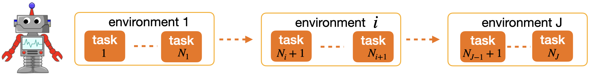
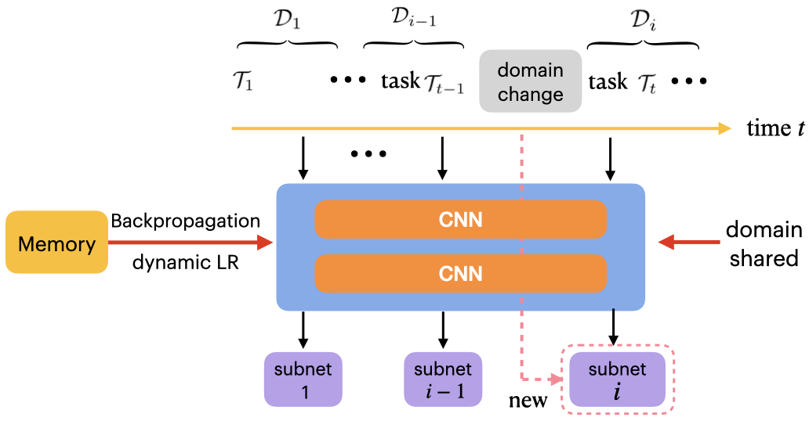
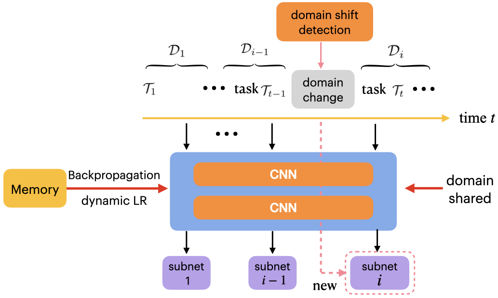

This repository contains the dataset and code accompanying the CVPR 2022 paper "Learning to Learn and Remember Super Long Multi-Domain Task Sequence" (Oral)



<!--  -->

Domain-Aware SDML            |  Domain-Agnostic SDML
:-------------------------:|:-------------------------:
  |  


#### Requirements to run the code:
---

1. Python 3.7
2. PyTorch 1.8.0
3. torchmeta 1.7.0
4. numpy 1.20.3
5. tqdm


#### Setup:
---

1. Install the above packages requirements

2. Download ten datasets ( ['Quickdraw', 'Aircraft', 'CUB', 'MiniImagenet', 'Omniglot', 'Plantae', 'Electronic', 'CIFARFS', 'Fungi', 'Necessities']) from google drive [here](https://drive.google.com/file/d/1e7T9WC6nIxm7DhhI-l5DgSy6Jz94fCe5/view?usp=sharing)
and put the dataset folder in the root directory of this project
   


#### Usage:
---

Training the meta-learning models for sequential arriving datasets

```python
python train_sequence.py      --data_path 'data/path'
```


Training the meta-learning models (Prototypical Network) with Meta Experience Replay (MER) for sequential arriving datasets

```python
python train_MER.py      --data_path 'data/path'
```


Training the meta-learning models (Prototypical Network) with Averaged GEM (AGEM) for sequential arriving datasets

```python
python train_AGEM.py      --data_path 'data/path'
```


Training the meta-learning models (Prototypical Network) with UCB for sequential arriving datasets

```python
python train_UCB.py      --data_path 'data/path'
```


Training the meta-learning models (Prototypical Network) with our methods for sequential arriving datasets

```python
python train_domain_aware.py      --data_path 'data/path'
```


Training the meta-learning models (Prototypical Network) with online domain shift detection for sequential arriving datasets

```python
python train_domain_shift_detection.py      --data_path 'data/path'
```


#### Reference
---


```
@InProceedings{Wang_2022_CVPR,
    author    = {Wang, Zhenyi and Shen, Li and Duan, Tiehang and Zhan, Donglin and Fang, Le and Gao, Mingchen},
    title     = {Learning To Learn and Remember Super Long Multi-Domain Task Sequence},
    booktitle = {Proceedings of the IEEE/CVF Conference on Computer Vision and Pattern Recognition (CVPR)},
    month     = {June},
    year      = {2022},
    pages     = {7982-7992}
}

```

#### Acknowledgement


Some codes of Bayesian online changepoint detection are from [link](https://github.com/epfl-lasa/changepoint-detection)